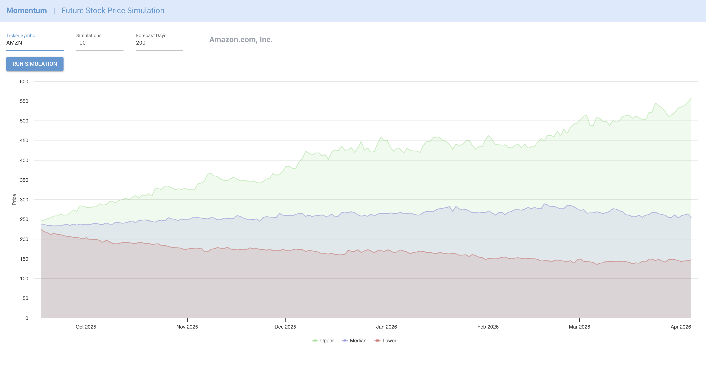

<h1 align="center"></h1>

    <b>Exploring the future of stocks through simple Monte Carlo simulations.</b>

   
   
   
   
  

**Momentum** is an experimental project for learning and experimentation with financial modeling.
It allows you to select a stock or index and run _Monte Carlo simulations_ to project potential future price evolution.

⚠️ This project is for **educational purposes only**. It is **not financial advice** and should not be used for real world investment decisions.

## How It Works

The simulator uses a Monte Carlo approach:

- Historical stock returns are calculated from price data (log returns).
- Thousands of possible future price paths are simulated, each applying random daily shocks sampled from the historical mean and volatility.
- From these simulations, the tool extracts summary forecasts:
  - Median (50th percentile): The “most typical” projected price path.
  - Lower band (10th percentile): A conservative estimate, only 10% of scenarios fall below this path.
  - Upper band (90th percentile): An optimistic estimate, only 10% of scenarios rise above this path.

The result is a range of possible outcomes rather than a single prediction, giving you a sense of uncertainty and probability around stock price evolution.

---

## How to run

1. Run `make start`
2. To stop press CTRL+C

## Features

- Enter a stock ticker (For exanoke with [Yahoo Finance](https://finance.yahoo.com/))
- Choose the number of days to forecast.
- Run multiple Monte Carlo simulations.
- Visualize the possible outcomes with interactive charts ([NiceGUI](https://nicegui.io/))
- Built with Python, Pandas, and NumPy.

---

## Screenshot

